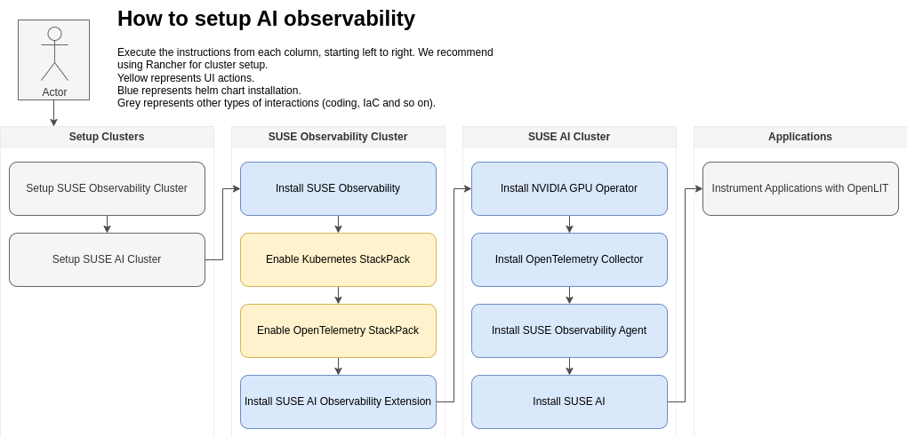

# SUSE AI Observability Extension

This extension expands the capabilities of [SUSE Observability](https://docs.stackstate.com) regarding GenAI applications. Applications instrumented with the [OpenLIT SDK](https://github.com/openlit/openlit/tree/main/sdk/python) generate metrics and traces, that are handled by the extension to generate topology views and observability over time.

## High-level Overview

SUSE AI Observability Extension requires a working instance of SUSE Observability.



## About

The extension has two main components:

* The SUSE AI Observability Setup, which handles the install/uninstall process for the extension.
* The SUSE AI Observability Runtime, which is responsible for calculating topology views and metrics.

Those components are distributed as a Helm Chart.

### Helm Chart Installation

You can use a genai-values.yaml containing basic information about your SUSE Observability.

```yaml
serverUrl:  https://xxxx.    # SUSE Observability URL. Installing this Chart within the same cluster from SUSE Observability allows you to use http://suse-observability-router.suse-observability.svc.cluster.local:8080
apiKey: xxx                  # SUSE Observability API Key
apiToken: xxx                # SUSE Observability CLI Token
clusterName: lab             # Cluster name as defined for the Kubernetes StackPack instance in SUSE Observability
```

Then run the following Helm commands,

```bash
helm upgrade --install --namespace so-extensions --create-namespace -f genai_values.yaml suse-ai-observability ./helm

```

### Project Content

In the cmd directory you will find the program responsible for the runtime execution of the extension.

The helm directory contains a simple chart for deploying the extension with minimal manual interventions.

The setup directory contains some static assets needed by the extension, and also, the scripts for the extension setup.

The internal and stackpack directories contain most of the Go code.

## Configuration

### Environment variables

Environment variables can be used to set up the scanner.

| Variable                     | Required | Default | Description                                      |
|------------------------------|----------|---------|--------------------------------------------------|
| STACKSTATE_API_URL           | yes      |         | The URL to the StackState server                 |
| STACKSTATE_API_KEY           | yes      |         | The API key used by the StackState server        |
| KUBERNETES_CLUSTER           | yes      |         | Kubernetes Cluster name as defined in StackState |
| KUBERNETES_QUERYTIMEINTERVAL | yes      | 1h      | Promql interval query over.                      |
| INSTANCE_TYPE                | yes      | openlit | The Custom Sync StackPack instance type.          |
| INSTANCE_URL                 | yes      |         | The Custom Sync StackPack instance url            |


## Development

### Requirements

- [Taskfile](https://taskfile.dev/installation/)

### Build

There are two main containers in the application. One, is the runtime that handles data synchronization, while the other manages the extension's lifecycle.

```shell
task podman-build-runtime
task podman-build-setup
```
