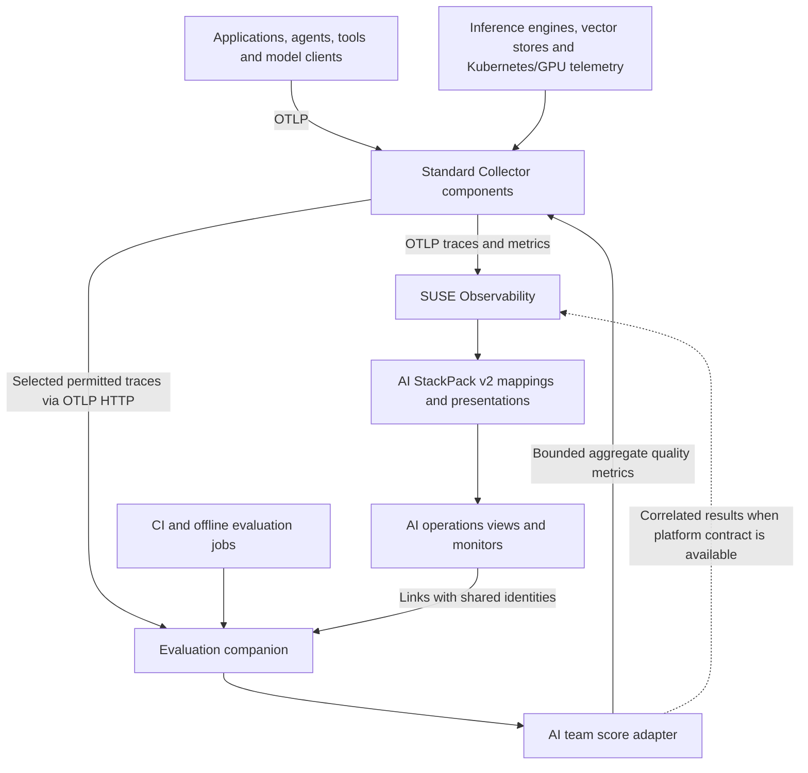

# Draft architecture for the SUSE AI extension on StackPacks v2

Assessment date: 2026-10-06. Status: proposal for engineering discussion; no runtime migration has been applied. Read with the [competitive strategy](AI_OBSERVABILITY_STRATEGY.md) and [platform requests](OBSERVABILITY_FEATURE_REQUESTS.md).

Use ordinary OTel telemetry as the input to platform-side topology mappings. Extend existing OTel/Kubernetes components where they represent the same entity, and create additional components only for distinct AI entities. Keep runtime invocations in traces and evaluation records. Retire the custom topology exporter only after proving equivalent coverage, identity, lifecycle and behavior under sampling.

## What v2 changes

SUSE Observability's **2.11.1** release notes explicitly describe StackPacks 2.0, including telemetry mappings and configurable UI extensions, and list CLI **3.9.0**. Use that documented release as an initial compatibility reference; confirm the exact supported server, CLI and base StackPack versions before implementation. “After 2.11” is not a sufficient compatibility specification. See the [release notes](https://rancher.github.io/product-docs-playbook/suse-observability/latest/en/setup/release-notes/v2.11.1.html).

Three mechanisms matter:

| Mechanism | Verified behavior | Proposed use |
| --- | --- | --- |
| `OtelComponentMapping` | CEL expressions select resource, scope, span, metric/datapoint or log data and produce component identities. Shared identifiers merge components; mapping rank affects name/type precedence. | Add AI classification to the canonical service; discover model endpoints or stable agent definitions from relevant telemetry. |
| `OtelRelationMapping` | Computes source and target identifiers; relations materialize when both components exist. | Connect applications, model endpoints and backing services without sending custom topology snapshots. |
| `ComponentPresentation` | Selects existing components and composes UI definitions with other matching presentations. | Add AI metrics, fields, related resources, menus, links and trace filters while preserving the ordinary operational context. |

Sources: [mapping schema](https://rancher.github.io/product-docs-playbook/suse-observability/latest/en/setup/custom-integrations/otelmappings/schemas-ref.html) and [presentation concepts](https://rancher.github.io/product-docs-playbook/suse-observability/latest/en/setup/custom-integrations/presentation/concepts.html).

This is **composition of independently owned settings**, not permission to edit another StackPack's settings in place. Keep AI mapping/presentation setting identifiers in the AI namespace. Reuse entity identifiers when the underlying entity is the same. Integration settings have immutable ownership in the documented release. See [2.11.1 integration ownership](https://rancher.github.io/product-docs-playbook/suse-observability/latest/en/setup/release-notes/v2.11.1.html).

The supplied [SUSE Virtualization example](https://github.com/StackVista/suse-stackpacks/tree/be6d22d6541e9c2eb098777b8a282b8fc3012fb0/stackpacks/suse-virtualization) demonstrates both patterns: its [launcher-pod presentation](https://github.com/StackVista/suse-stackpacks/blob/be6d22d6541e9c2eb098777b8a282b8fc3012fb0/stackpacks/suse-virtualization/settings/presentations/virt-launcher-pods.sty) selects existing pods; its [VMI mapping](https://github.com/StackVista/suse-stackpacks/blob/be6d22d6541e9c2eb098777b8a282b8fc3012fb0/stackpacks/suse-virtualization/settings/component-mappings/virtual-machine-instance.sty) creates a distinct entity from Kubernetes object logs; its [node relation](https://github.com/StackVista/suse-stackpacks/blob/be6d22d6541e9c2eb098777b8a282b8fc3012fb0/stackpacks/suse-virtualization/settings/relation-mappings/vmi-runs-on-node.sty) links that entity to a Kubernetes node.

The [official microservice scaffold](https://github.com/StackVista/stackpack-templates/blob/6e8d035ca5d666c48a8b323798ef540e425c0e4e/templates/generic/settings/component-mappings/microservices.sty) adds the canonical OTel service-instance identifier as an alias. It deliberately ranks its mapping below the generic OTel mapping to retain the ordinary type and metric inheritance. Follow this approach initially. A specialized presentation usually provides the desired AI experience without changing the primary type. Copying a rank value blindly is insufficient: inspect the installed base mappings and test all contributing presentations.

One important exception: external-topology synchronization sources take precedence over OTel mappings for component names/types regardless of mapping rank. Legacy and v2 writers sharing identifiers can therefore mask migration failures. Also, the mapping schema describes record-local fields; it does not establish arbitrary joins between parent and child spans or across traces. Preserve normal distributed tracing and obtain missing cross-record execution behavior through supported platform capabilities. See [merging and input fields](https://rancher.github.io/product-docs-playbook/suse-observability/latest/en/setup/custom-integrations/otelmappings/schemas-ref.html).

## Proposed architecture

Solid paths are the proposed initial integration using existing kinds of capabilities, subject to target-version testing. The dashed result path depends on the platform contract in FR2. A regular Collector distribution must be selected and validated; this diagram does not certify a particular binary. Sampling must satisfy the independent topology requirements below.

The AI team owns instrumentation profiles, Collector configuration, the StackPack, evaluator logic and the optional score adapter. SUSE Observability owns ingestion/storage/query guarantees, access control and the native UI primitives. Evaluation jobs run outside Collector processors and topology synchronization functions. They can be ordinary CI/Kubernetes jobs or a companion's workers; no new Go runtime is required in this extension.

## Entity and identity model

| Entity | Representation | Identity and relationship rule |
| --- | --- | --- |
| Application/service | Existing OTel service and instances | Reuse installed canonical identifiers. Add AI role labels/presentations. Keep service-to-instance-to-pod relations. |
| vLLM/Ollama/LiteLLM/vector DB/MCP deployment | Existing service, database or Kubernetes workload when it describes the same deployment | Classify by reliable resource/inventory evidence. Add relations across different abstraction levels; do not merge a service, pod and model into one node. |
| Logical agent definition | Optional distinct AI component when several agents share a service | Use a stable application-scoped agent identity and link to the host service. Do not assume a provider-generated agent ID is always a reusable definition ID. |
| Model endpoint/deployment | Distinct AI entity where no equivalent canonical entity exists | Scope by tenant/environment, provider endpoint or serving deployment, and model identity. Relate it to the serving service or external endpoint. |
| Model artifact/version | Optional inventory-backed entity | Registry/artifact identity plus version/digest when known. Link deployments to artifacts rather than equating a requested alias with model weights. |
| Agent invocation, tool call, retrieval, generation | Spans and correlated events | Trace/span identity; retain parent relationships and links. Do not create a topology node per invocation. |
| Conversation, feedback, evaluation result, experiment item | Execution/evaluation records | Keep high-cardinality IDs in record storage. Link to stable topology entities and versions. |
| Kubernetes node and GPU | Existing infrastructure identity where available | Extend its presentation; retain cluster and device identity. |

For genuinely new entities, use a consistent `urn:suse-ai:` namespace. Define deterministic escaping and normalization, then test missing attributes and collisions. The current product extractor uses `urn:suse-ai:product:<type>:<name>`; this does not encode tenant, environment or endpoint. The migration should not carry that ambiguity into new model/endpoint identities. See the [current product ID extractor](../stackpack/suse-ai/provisioning/templates/sync/suse-ai-product-id-extractor.groovy).

Do not improvise a replacement for the base OTel identifier format. Export the installed mappings, establish the platform's intended service namespace/environment boundaries, and test same-named services in different clusters and tenants. Use legacy aliases only where the correspondence is unambiguously one-to-one; a former globally aggregated product cannot safely alias several separate new deployments.

Treat `gen_ai.provider.name` as provider information reported by instrumentation. An OpenAI-compatible client may be calling a locally hosted engine. Use endpoint and deployment evidence to distinguish those cases. Retain requested and response model names separately, and represent an inferred endpoint as inferred rather than claiming a known physical deployment. See the [provider attribute definition in released conventions](https://github.com/open-telemetry/semantic-conventions/blob/v1.41.0/docs/registry/attributes/gen-ai.md).

## Telemetry contract

1. **Keep resource identity truthful.** Preserve `service.name`, `service.namespace`, `service.instance.id`, service version and actual Kubernetes metadata. Do not overwrite the real `telemetry.sdk.name` for branding; identify SUSE instrumentation through its scope and explicit extension attributes. Resource identity describes the emitter, not every model that it happens to call. The stable service attributes were checked against [core semantic conventions 1.44.0](https://github.com/open-telemetry/semantic-conventions/tree/v1.44.0/model/service).
2. **Keep operation facts on operations.** Read `gen_ai.operation.name`, provider, requested/responding model, token usage, agent/tool attributes and `server.address` from the matching span or metric point. Use the appropriate HTTP/database/MCP semantics for non-model calls. Do not label KServe control-plane or Model Registry calls as a GenAI provider merely to create a relation.
3. **Define explicit compatibility profiles.** The last pre-move core release inspected here is [v1.41.0](https://github.com/open-telemetry/semantic-conventions/releases/tag/v1.41.0), whose GenAI conventions still have Development status. The conventions have [moved](https://opentelemetry.io/docs/specs/semconv/gen-ai/) to a separate repository. On the assessment date its tags endpoint returned no tags, its changelog was unreleased, and its [manifest](https://github.com/open-telemetry/semantic-conventions-genai/blob/4f85037ef86e92c510d2ef881a58f1076f6fc0e4/model/manifest.yaml) declared `gen-ai-dev/1.42.0-dev`. Use v1.41.0 as an explicit released compatibility reference and evaluate the newer development profile separately; record the actual profile emitted by each SDK. A released package does not make every convention Stable.
4. **Correct metric semantics during migration.** In that v1.41.0 profile, `gen_ai.client.token.usage` is a histogram, not a counter; operation duration is a seconds histogram. The current [conventions note](OTEL_CONVENTIONS.md) calls token usage a counter but later lists histogram series. The newer development source has changed inference metric organization again. Test metric type, units, temporality and Prometheus translation per supported profile instead of renaming everything to a moving target. See [released metrics](https://github.com/open-telemetry/semantic-conventions/blob/v1.41.0/docs/gen-ai/gen-ai-metrics.md) and [development metrics](https://github.com/open-telemetry/semantic-conventions-genai/blob/4f85037ef86e92c510d2ef881a58f1076f6fc0e4/docs/gen-ai/gen-ai-metrics.md).
5. **Capture content deliberately.** Make prompts, outputs, tool arguments/results and retrieved text opt-in. Redact at the source/Collector before branching to destinations. Apply access policies to remaining content. Keep user/session IDs, prompts, document text and trace IDs out of metric labels and topology identifiers.
6. **Treat scores as asynchronous records.** The development `gen_ai.evaluation.result` event carries evaluation name, value/label and optional explanation, correlated to the evaluated operation when possible. It is a Logs event, not a requirement to mutate an already-ended span. Add clearly namespaced fields for evaluator version, dataset/experiment identity and score provenance where the chosen standard profile lacks them. Preserve both the operation's time and the evaluation time. See [evaluation event](https://github.com/open-telemetry/semantic-conventions-genai/blob/4f85037ef86e92c510d2ef881a58f1076f6fc0e4/docs/gen-ai/gen-ai-events.md).

Until native score correlation is available, persist detailed results in the evaluation companion and export aggregate counters/histograms plus links. Proposed metrics such as `suse.ai.evaluation.completed`, `suse.ai.evaluation.failed`, and score distributions are SUSE conventions, not claimed OTel standards. Separate evaluator execution failure from an evaluated answer that fails its rubric. Keep dimensions bounded to application, model/agent version, evaluator/version and outcome; publish evaluated and eligible counts so users can assess coverage.

## Collector changes

The custom `topology` exporter is outside the upstream Collector component index. Its [pinned distribution README](https://github.com/SUSE/suse-ai-opentelemetry-collector/blob/v0.156.0/README.md) describes a Kubernetes-based distribution adding both that exporter and an Elasticsearch receiver. Its [topology source](https://github.com/SUSE/suse-ai-opentelemetry-collector/blob/v0.156.0/topologyexporter/topology.go) discovers application/provider/model/database entities and relations and expires accumulated state. Replacing it requires replacing these responsibilities, not just deleting one exporter entry.

| Current configuration | Proposed treatment | Condition |
| --- | --- | --- |
| `topology` exporter and `traces/topology` | Retire after v2 parity; remove its intake credentials and dedicated topology stream usage | Equivalent entities, edges, expiration and low-traffic behavior verified |
| `metrics/infer-providers`, `metrics/infer-models` | Replace synthetic resource/service rewrites with mappings over original datapoint attributes | Model/provider discovery still works from metrics-only applications |
| `metrics/infer-applications` | Classify the original service through a mapping or explicit stable resource metadata | Preserve namespace and base service identity |
| `traces/model-relations`, `traces/provider-relations` | Replace altered trace copies with relation mappings | A single retained span reaches each trace backend; all required edges exist |
| Kubeflow topology-only synthetic provider attributes | Map actual HTTP/RPC/peer/inventory evidence | KFP → KServe and KFP → Model Registry coverage proven |
| Prometheus scrapes, engine-specific normalization, HTTP checks and Kubernetes enrichment | Retain where they provide real operational signals | Preserve all supported integrations; do not drop absent demo targets globally |
| `memory_limiter`, buffering/retries, sampling and pre-sampling metrics | Retain, simplify and validate against a pinned distribution | Equivalent reliability and statistical meaning |
| Logs pipeline | Add only for a defined evaluation/content or inventory use case | Confirm destination ingestion, retention, correlation and permissions; logs-to-topology support alone does not establish those guarantees |

The [Helm values](../integrations/otel-collector/otel-values.yaml) and [Operator configuration](../integrations/otel-collector/otel-collector-operator.yaml) must be migrated together. The Helm values explicitly disable their default logs pipeline. Removing the topology exporter does not automatically permit the minimal Collector core binary: verify the selected distribution still includes every used receiver, processor, connector and exporter, including Elasticsearch/OpenSearch and HTTP checks. A supported distribution assembled entirely from upstream components may remain appropriate without custom topology code.

### Sampling and accounting

Today the custom exporter and synthetic topology paths receive traces before the ordinary tail-sampled export path. If v2 sees only sampled traces, a rarely invoked agent/model/tool may disappear even though the mapping itself is correct. The current topology source also expires elements after inactivity. This is a migration acceptance issue, not a reason to keep synthetic service identities permanently.

For the initial bounded proof of concept, send all relevant traces once and measure ingestion volume. For production, agree on one supported approach: platform mapping before storage sampling; bounded metrics/inventory that refresh topology independently; or documented topology ingestion independent of trace retention. If none satisfies required completeness, retain the legacy path temporarily and escalate FR0. Do not send a second unmarked copy of the same spans to the same trace store.

Calculate operational span metrics and usage from the full observed stream before tail sampling, or use independently emitted SDK/server metrics. Do not count both for the same accounting purpose. The [SUSE sampling guide](https://rancher.github.io/product-docs-playbook/suse-observability/latest/en/setup/otel/sampling.html) explicitly separates span-metric generation from sampling. Size tail-sampling windows for agent durations and route a trace consistently when scaling collectors; a ten-second window needs testing against long-running agents.

Keep evaluation sampling separate from diagnostic sampling. A sample enriched for errors is useful for debugging but biases quality-rate estimates. Delayed scores cannot retroactively influence a completed sampling decision. Publish coverage and keep a representative quality sample as well as failure investigations.

Provider token charges, evaluator charges and locally hosted GPU cost are different accounting categories. Version external-model prices and cache-token rules; define a separate allocation model for shared GPU infrastructure. Do not promise invoice-grade cost from incomplete or sampled spans. Audit existing cost queries as part of migration rather than assuming a chart labeled “cost” already supplies these semantics.

## Packaging and implementation sequence

V2 uses `stackpack.yaml` with `schemaVersion: "2.0"`, plain YAML settings and file references such as `!include` and `!resource`. The supported setting types differ from the current Groovy provisioning/Handlebars snapshot layout; this is a conversion, not a manifest rename. Existing `.sty` files containing `{{ ... }}` cannot be copied unchanged. Included monitor remediation text can still use its supported runtime templating. See the [StackPack reference](https://documentation.suse.com/cloudnative/suse-observability/latest/en/setup/custom-integrations/stackpacks.html).

1. **Establish the target and fixtures.** Pin platform/CLI/base StackPacks and Collector versions. Export installed mappings, presentations, monitor selectors and entity IDs. Record current entity/edge sets, selected metric results and payload counts. Use a separate validation tenant/instance for parallel comparison where possible.
2. **Prove composition with one workload.** Add an AI presentation to an existing OTel service, then derive one model endpoint and relation from unmodified telemetry. Preserve generic metrics and pod links. Test customer overrides and uninstall behavior. Separately test traces-only and metrics-only discovery.
3. **Migrate the package and operational coverage.** Convert presentations, metric definitions, monitors, menus and relation/component mappings. Include vLLM/Ollama, vector/search stores, GPU and Kubeflow workflows. Keep historical documentation and ComponentType `iconbase64` fields intact. Migrate icon references without editing those protected fields.
4. **Cut over writers and Collector configuration.** Prove the v2 graph independently, then stop legacy synthetic pipelines and the old topology writer in a controlled sequence. Retire legacy sync contributions only after v2 supplies the affected identities. Verify expiry and disappearance of obsolete components, not only creation of new ones. Preserve an explicit legacy rollback configuration until the acceptance window closes.
5. **Add quality integration.** Connect one evaluator/companion, correlate a result to a trace, expose aggregate quality metrics and an investigation link, then run a baseline/candidate experiment. Native score storage remains a separate platform deliverable.

Keep build, validation, versioning and status operations in Taskfile tasks. Update `Dockerfile`, `init.sh` and archive packaging for the v2 layout in the implementation change. A breaking topology/identity change should use a new major extension release, with a supported legacy line for older platforms where required. Never reuse an uploaded version; reconcile the existing `stackpack.conf` version task with the new manifest before any v2 upload. Preserve the repository's `--unlocked-strategy overwrite` upgrade rule and verify its exact applicability with the supported CLI; do not silently substitute a different ownership model.

Rollback must also respect version uniqueness: if a rollback requires an upload, package the known-good legacy content under a new unused version. Capture old-to-new identity mappings and user-view/monitor references. Aliases do not automatically preserve all internal IDs or historical behavior across reinstallations; make that an explicit test.

## Exporter retirement acceptance criteria

| Test | Required observation |
| --- | --- |
| Single RAG/agent flow | Application/agent → model endpoint and vector/MCP dependencies appear without duplicate services or rewritten backend spans |
| Kubeflow flow | Pipeline → KServe and Model Registry relations survive; model lifecycle and synthetic endpoint checks still attach correctly |
| Tenant/environment isolation | Same-named services/models in two scopes stay distinct; genuine shared services aggregate only by design |
| Identity and presentation | Base OTel service/instance/pod links, standard metrics, custom monitors and AI presentations survive upgrade and override composition |
| Sampling and idle periods | Low-volume dependencies, long-running agents and late spans behave as specified; expiration/refresh is observable |
| Accounting | No extra trace copies or duplicated token/cost series; pre-sampling operational totals match fixtures |
| Data-source independence | Traces-only, metrics-only and inventory-driven entities work where promised; inferred entities are distinguishable |
| Writer removal and rollback | Removing the legacy source does not remove v2-owned entities or leave stale duplicates; rollback restores coverage with unique upload versions |
| Quality integration | A delayed score links to the correct retained operation; missing/sampled-out traces are explicit; no unauthorized content is exposed |

Validate the v2 package against the target platform and use its version-matched CI validator. Continue the required `sts topology-sync list`/`describe` checks for legacy syncs, and also inspect v2 `sts otel-component-mapping` and `sts otel-relation-mapping` list/status outputs. Zero legacy errors do not prove v2 correctness. See [mapping troubleshooting](https://documentation.suse.com/cloudnative/suse-observability/latest/en/setup/custom-integrations/otelmappings/troubleshooting.html) and the [example validator wrapper](https://github.com/StackVista/suse-stackpacks/blob/be6d22d6541e9c2eb098777b8a282b8fc3012fb0/scripts/ci/validate_stackpack.sh).

The configured platform was unreachable during this assessment, so these criteria remain unexecuted. The architecture supports a staged deprecation decision; it does not yet establish that every custom-exporter responsibility is redundant.
