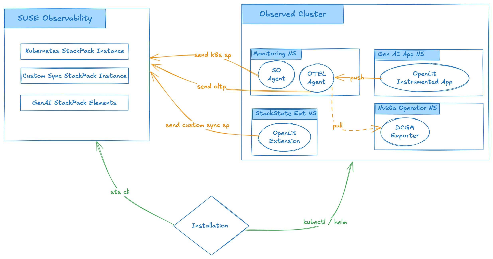

# Setup Guide

This guide contains instructions on how to setup the OpenLit Extension for SUSE Observability.



## Prerequisites

Ensure you have the following tools installed and properly configured:

- **[SUSE Observability CLI](https://docs.stackstate.com/cli/cli-sts)** – Command-line interface for SUSE Observability.
- **[Taskfile](https://taskfile.dev/installation/)** – A task runner for automating commands.
    - Supports tab completion, making it easy to view available tasks.
- **[Gomplate](https://docs.gomplate.ca/installing/)** – A powerful template processor.
- **[Helm](https://helm.sh/docs/intro/install/)** – A package manager for Kubernetes.

Check out this repository and execute all commands from its root.

```bash
git clone https://github.com/ravan/genai-observability-extension.git
cd genai-observability-extension
```

Setup your `.env` with correct values for

```
# The working directory to resolve the KUBECONFIG_FILE_NAME
KUBECONFIG_FILE_PATH=/Users/rnaidoo/sts/repos/github/ravan/genai-observability

# --- Target SUSE Observability Backend --

# Name of kubeconfig file used to connect to your observed cluster
KUBECONFIG_FILE_NAME=gcloud-kubeconfig

# Name of the cluster as defined in SUSE Observability Kubernetes StackPack Instance
CLUSTER_NAME=genai-apps

# The url to your SUSE Observanility instance
STS_URL=https://xxx.io

# The Open Telemetry Protocol host name
STS_OTLP=otlp-xxx.io

# Your SUSE Observability API_KEY
STS_API_KEY=181335cxxxxxx

# Your SUSE Observability CLI Token.
STS_TOKEN=tRa6xxxxx

# --- HELM Repo --

# helm add stackstate-addons https://ravan.github.io/helm-charts/
HELM_REPO=stackstate-addons
```

## Setup SUSE Observability

### Stack Instances

Create stackpack instances on SUSE Observability to prepare topology ingestion pipelines
to receive data from the observed cluster

#### Kubernetes StackPack Instance

Create an instance to receive data from the downstream observed cluster. The instance name is determined by your
`CLUSTER_NAME` environment variable.

```bash
task install-k8s-stackpack-instance
```

#### AutoSync StackPack Instance

You most probably do not have the AutoSync StackPack installed by default.
Upload the stackpack using,

```bash
task upload-autosync-stackpack-instance
```

Next create an instance to receive data from our extension that will be installed on the downstream observed cluster.

```bash
task install-autosync-stackpack-instance
```

### GenAI StackPack Elements

Elements like menu, overview page, highlight page, etc are installed by a post-install helm hook, in the helm chart.
To run everything individually, try:

```bash

task stackpack:install
```


## Setup Observed Cluster

### SUSE Observability Agent

If you have not already installed the agent on the downstream cluster, you can run:

```bash
task deploy-observability-agent
```

### SUSE Observability OpenTelemetry Collector

If you have already installed the OpenTelemetry collector, please remove it.
We will need to install the collector configured to scrape the `DCGM Exporter` in
the `gpu-operator` namespace. Please note if the exporter is in another namespace, 
you will have to edit the task to change the namespace to which to deploy the RBAC configuration.

We use a Helm chart that a pre-configured for SUSE Observability, but still allows us
to configure additional jobs.

```bash
helm add stackstate-addons https://ravan.github.io/helm-charts/
helm repo update
```

Deploy the collector, 
```bash
task deploy-otel-collector
```

### Deploy GenAI Extension

The GenAI extension analyses the OpenLit metrics that was sent to SUSE Observability via the OpenTelemetry collector.
It will generate topology for those metrics.

```bash
task deploy-openlit-ext
```

### Deploy Demo Apps.

If you wish to deploy the demo apps Rag101, Rag102 and PirateJoke that were instrumented with
OpenLit, then adjust the `model` and `ollamaEndpoint` in the task `deploy-genai-apps` to match your
environment.

```bash
task deploy-genai-apps
```
